# Slopeer

Slopeer is a PWA for climbers that allows users to discover new climbing routes around them, see detailed information about
them and save that information for offline use when in the mountains ⛰.

In can be used from the browser, but also installed to any computer or mobile phone as it it was a native app.

<h1 style="text-align: center">Register or Log in</h1>

  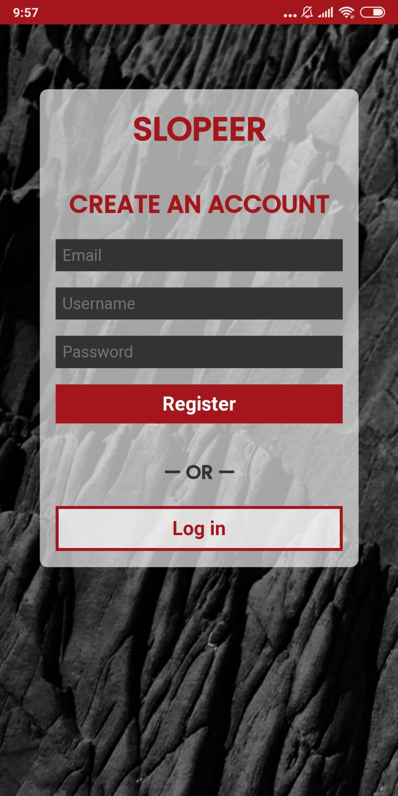
  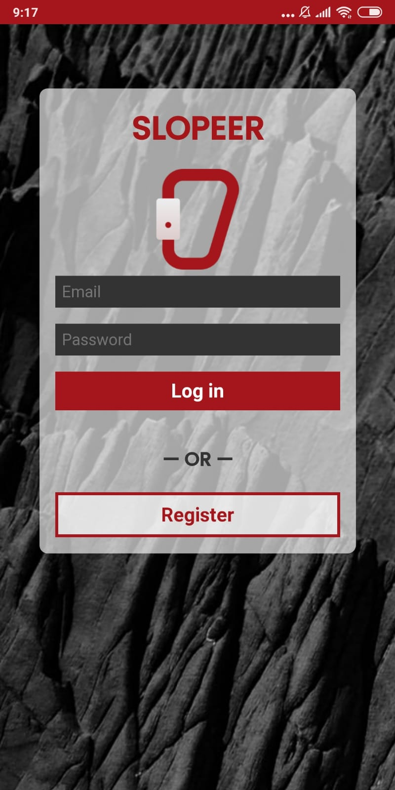

<h1 style="text-align: center">Add new routes</h1>

  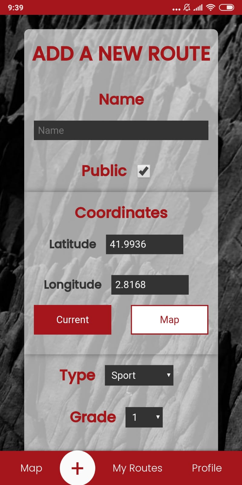
  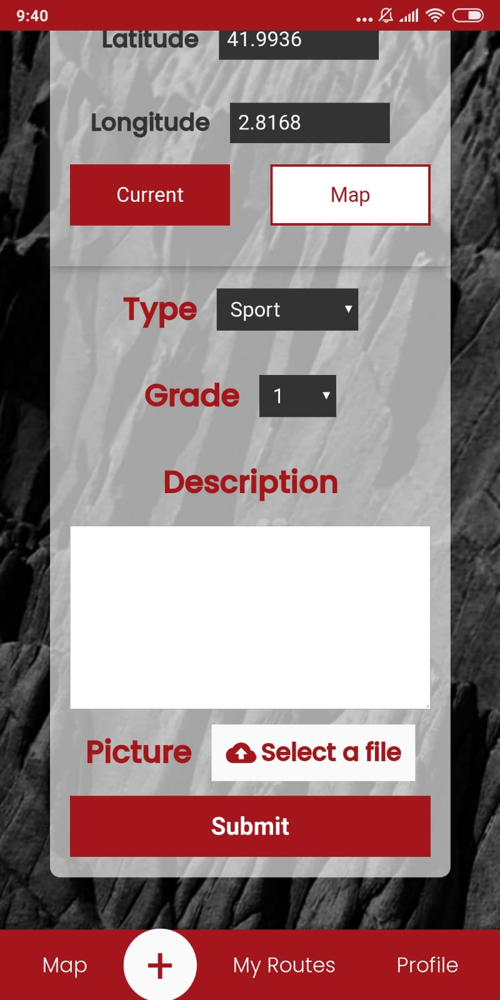
  

<h1 style="text-align: center">Browse added routes. Even when offline</h1>

  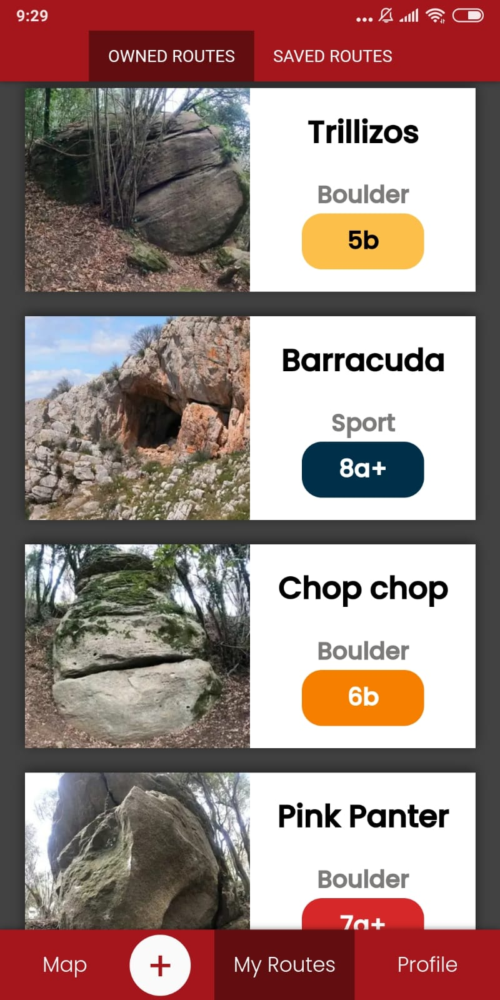
  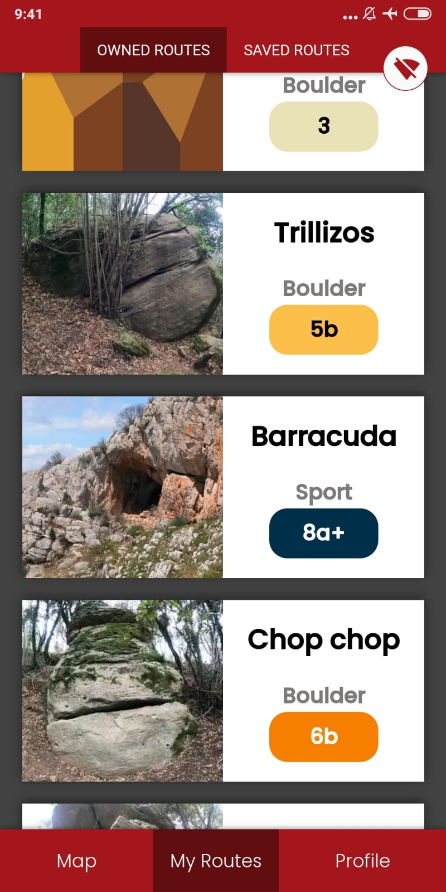

<h1 style="text-align: center">See route details</h1>

  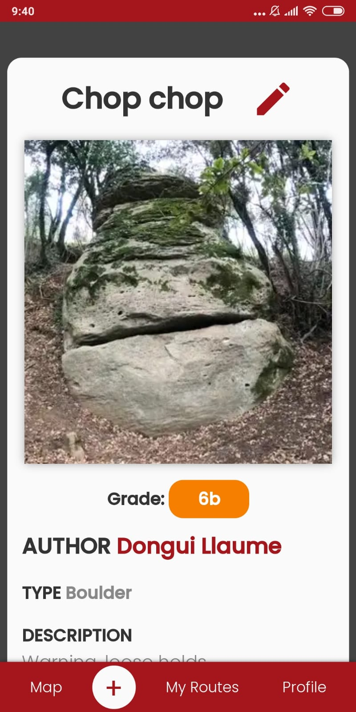

<h1 style="text-align: center">Discover new routes using the map</h1>

  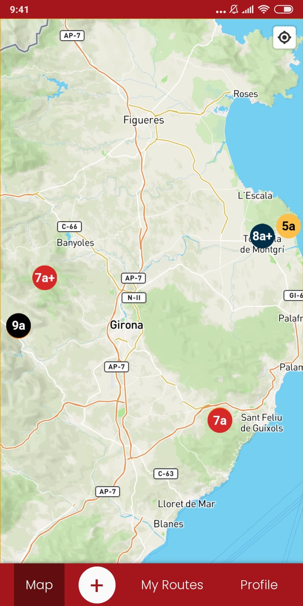
  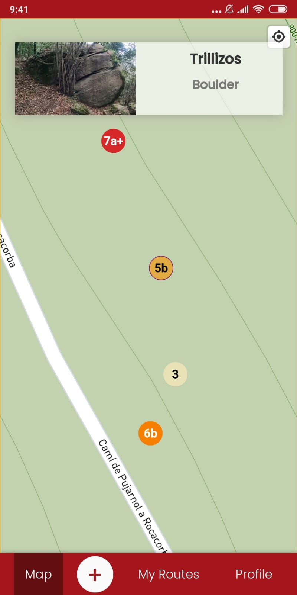

<h1 style="text-align: center">Customize your profile or check out other users</h1>

  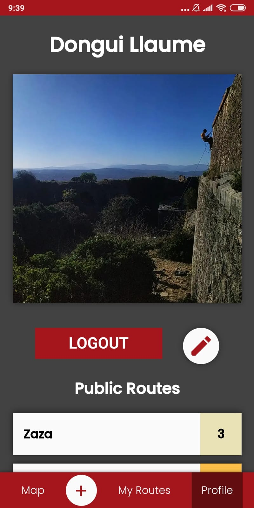
  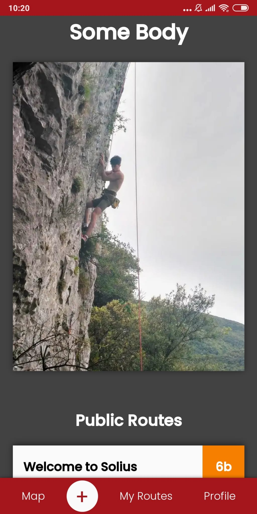

